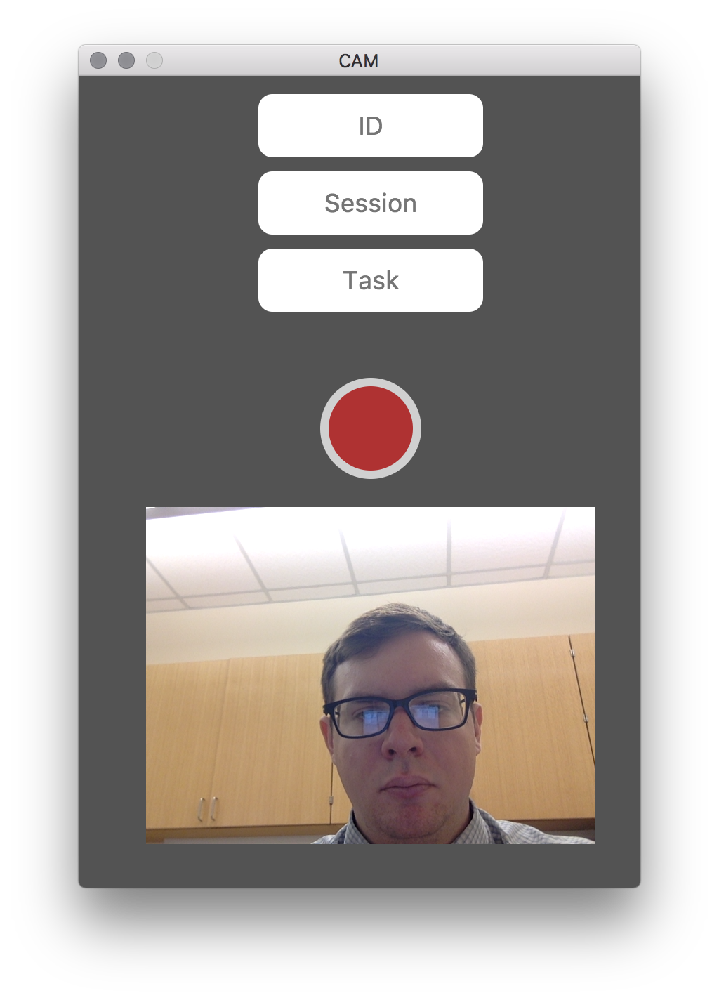
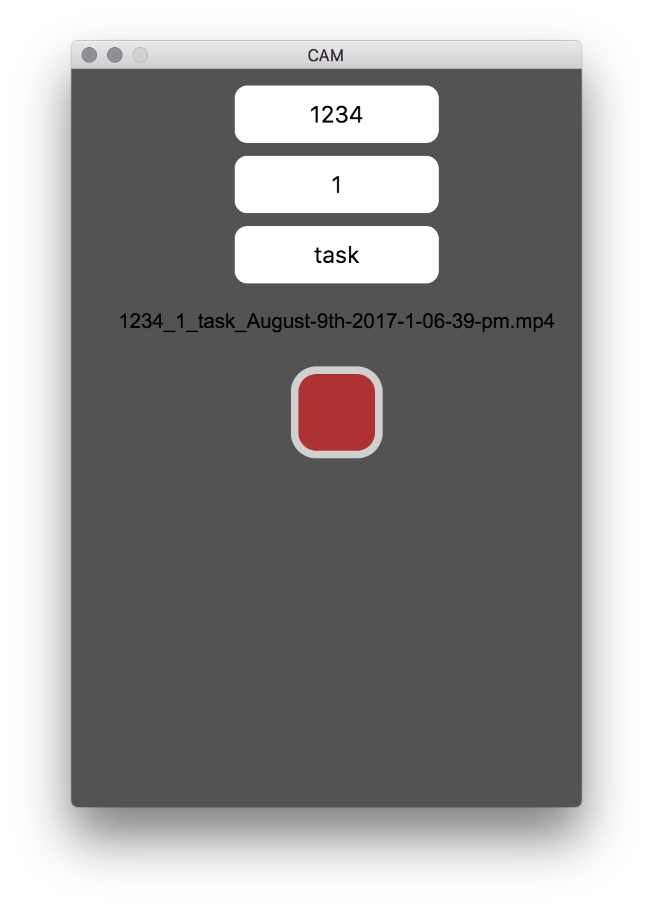
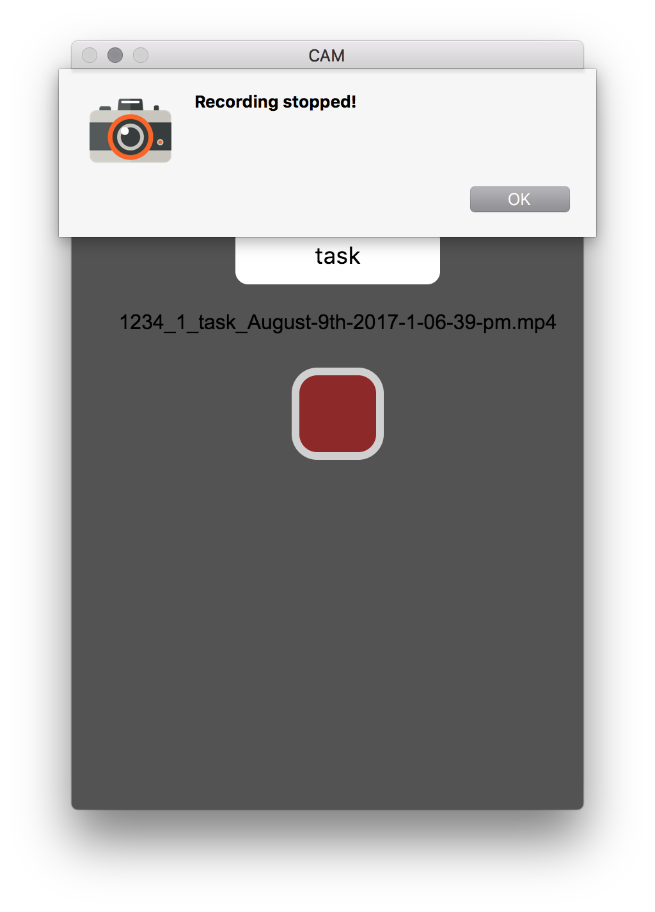

# CAM

##### Dowload the [latest version](https://github.com/hanayik/CAM/releases/latest)

### Description
The CAM app was made for recording short tasks with research participants for later scoring or analysis.

The CAM app's design is as minimalist as possible. To use, just launch the app and you will immediately see a preview of the camera image. The app will not record until you click the red record button. Before recording though, it's a good idea to use the text input fields to give your recording a name. As you type in the fields you will see an automatically generated preview of what your video will be named.

While recording, the preview will not be shown. This is intentional so that it's not distracting to research participants. 

When you're done recording click the red square and your video will be saved. 

The saved location will depend on your computer. The program automatically detects if you have Dropbox, or Box folders on your computer and tries to save to those locations first, in that order. If you do not wish to save to the cloud folders then uncheck that option in the menu bar. If the cloud saving option is unchecked, or those folders do not exist on your computer then the app will save to it's default MacOS location which is ``` ~/Library/Application Support/CAM/data/ ```

### Screenshots








### Credits
[Icon](http://www.flaticon.com/packs/camp-collection)
 
[ffmpeg](https://www.ffmpeg.org/)


### License
[MIT](https://github.com/hanayik/CAM/blob/master/LICENSE)

This app was made specifically for the CSTAR group, but is open source so that others may modify and use as desired. 


### Developers
CAM is currently only developed for MacOS, and a compiled version of ffmpeg is bundled with the app. 

##### To clone repo:

``` cd /to/your/desired/install/location ```

``` git clone https://github.com/hanayik/CAM.git ```

##### To install packages:

``` cd CAM ```

``` npm install ```

##### To run

``` npm start ```


### Links
[CSTAR](https://cstar.sc.edu/)

[Aphasia Lab](https://web.asph.sc.edu/aphasia/)


